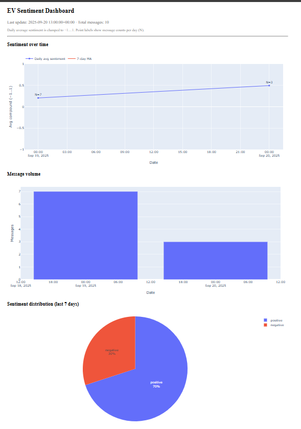

# EV Sentiment Data Pipeline (Portfolio Project)

End-to-end data engineering + analytics pipeline:
- **Sources**: Hacker News + EV-related RSS (no auth)
- **Storage**: PostgreSQL (Docker)
- **Processing**: Python (ingest → clean → sentiment → aggregate)
- **Orchestration**: Prefect
- **Dashboard**: Plotly Dash

## Quick Start

### 1) Prerequisites
- Python 3.10+
- Docker Desktop
- Git (optional)

### 2) Environment setup
```bash
python -m venv .venv
# Windows PowerShell:
.\.venv\Scripts\Activate
# macOS/Linux:
source .venv/bin/activate

pip install -U pip
pip install -r requirements.txt

python -c "import nltk; import ssl; ssl._create_default_https_context = ssl._create_unverified_context; import nltk; nltk.download('vader_lexicon'); nltk.download('stopwords')"
```

### 3) Database
```bash
docker compose up -d postgres
```

### 4) Run pipeline once
```bash
python pipelines/ingest.py
python pipelines/clean.py
python pipelines/sentiment.py
python pipelines/aggregate.py
```

### 5) Start dashboard
```bash
python app/dash_app.py
# Then open http://localhost:8050
```

### 6) Orchestrate (optional)
```bash
python orchestrate/flow.py
```

## Project Structure
```
pipelines/        # ingest/clean/sentiment/aggregate
orchestrate/      # Prefect flow
app/              # Dash app
db/               # schema + init
docker-compose.yml
.env.example
```

## Notes
- Default language filter: English
- Sentiment: NLTK VADER (fast). Swap to a transformer if needed.
- Data kept in 3 layers: raw → dw.messages → dw.sentiment → dw.daily_metrics
- Replace sources with Twitter/Reddit if you have API keys.

## Dashboard Preview


## Insights (example)
From the latest run (Sept 2025):
- ~10 EV-related stories/comments ingested per day.
- Overall sentiment is slightly positive (avg compound ~0.35).
- Volume spikes align with major product/news announcements.
- Most neutral posts come from RSS feeds; HN tends to skew negative.
